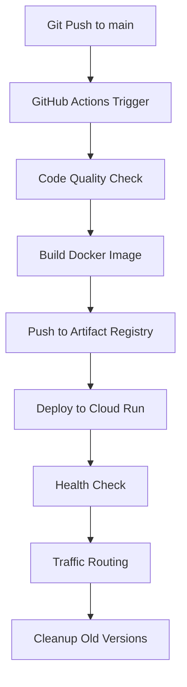

# GitHub Actions 自动部署到 GCP 指南

## 🚀 概览

本项目使用 GitHub Actions 实现自动化 CI/CD 流水线，将 WeeklyReporter 应用部署到 Google Cloud Platform 的 Cloud Run 服务。

## 📋 部署架构



## 🔧 前置要求

### 1. GCP 项目设置
- **项目 ID**: `solar-idea-463423-h8`
- **区域**: `asia-east1` (台湾)
- **服务账号**: `weeklyreporter@solar-idea-463423-h8.iam.gserviceaccount.com`

### 2. 必需的 GCP API
确保以下 API 已启用：
```bash
gcloud services enable run.googleapis.com
gcloud services enable cloudbuild.googleapis.com
gcloud services enable cloudscheduler.googleapis.com
gcloud services enable artifactregistry.googleapis.com
```

### 3. 服务账号权限
服务账号需要以下 IAM 角色：
- `Cloud Run Developer`
- `Artifact Registry Writer`
- `Storage Object Admin`
- `Cloud Scheduler Admin`

## 🔐 GitHub Secrets 配置

在 GitHub 仓库设置中添加以下 Secrets：

### 必需的 Secrets:
```
GCP_SA_KEY: <Service Account JSON Key 完整内容>
```

### 获取 Service Account Key:
```bash
# 创建并下载服务账号密钥
gcloud iam service-accounts keys create ~/weeklyreporter-key.json \
  --iam-account=weeklyreporter@solar-idea-463423-h8.iam.gserviceaccount.com

# 将文件内容复制到 GitHub Secrets
cat ~/weeklyreporter-key.json
```

## 🔄 工作流程详解

### 1. 代码质量检查 (test job)
- **触发条件**: 所有 push 和 pull request
- **执行内容**:
  - Python 语法检查
  - 依赖安装测试
  - 基础模块导入测试

### 2. 构建和部署 (build-deploy job)
- **触发条件**: 仅 main 分支的 push
- **执行内容**:
  - 构建 Docker 镜像 (带 Git SHA 标签)
  - 推送到 Artifact Registry
  - 部署到 Cloud Run
  - 健康检查
  - 流量路由到新版本
  - 清理旧版本 (保留最近3个)

### 3. PR 预览构建 (preview-build job)
- **触发条件**: Pull Request
- **执行内容**:
  - 构建预览镜像 (不部署)
  - 验证构建过程

## 📊 部署配置

### Cloud Run 服务配置:
```yaml
服务名: weeklyreporter
区域: asia-east1
内存: 1Gi
CPU: 1 vCPU
超时: 3600秒 (1小时)
最大实例: 3
最小实例: 0
端口: 8080
```

### 环境变量:
- `TZ=Asia/Shanghai`
- `GIT_SHA=${{ github.sha }}`
- `DEPLOY_TIME=$(部署时间)`

## 🎯 自动化功能

### 1. 版本管理
- 每次部署使用 Git SHA 作为镜像标签
- 同时推送 `latest` 和 `sha-xxxxxx` 标签
- 自动清理超过3个的旧版本

### 2. 健康检查
- 部署后自动检查服务健康状态
- 验证关键端点响应
- 失败时提供调试信息

### 3. 流量管理
- 蓝绿部署策略
- 逐步切换流量到新版本
- 保留回滚能力

## 🚨 使用方法

### 自动部署
```bash
# 1. 提交代码更改
git add .
git commit -m "Add new feature"

# 2. 推送到 main 分支 (触发自动部署)
git push origin main

# 3. 在 GitHub Actions 查看部署进度
# https://github.com/AmosFang927/WeeklyReporter/actions
```

### 手动触发
```bash
# 在 GitHub Actions 页面点击 "Run workflow" 按钮
# 或使用 GitHub CLI
gh workflow run deploy.yml
```

### PR 预览
```bash
# 创建 PR 时自动构建预览镜像
git checkout -b feature/new-feature
git push origin feature/new-feature
# 在 GitHub 创建 Pull Request
```

## 📈 监控和日志

### 1. 部署状态
在 GitHub Actions 页面查看：
- https://github.com/AmosFang927/WeeklyReporter/actions

### 2. 服务监控
```bash
# 获取服务 URL
SERVICE_URL=$(gcloud run services describe weeklyreporter \
  --region asia-east1 --format 'value(status.url)')

# 健康检查
curl $SERVICE_URL/
curl $SERVICE_URL/status

# 手动触发任务
curl -X POST $SERVICE_URL/run
```

### 3. 日志查看
```bash
# Cloud Run 服务日志
gcloud logs read --limit=50 \
  --filter='resource.type="cloud_run_revision" AND resource.labels.service_name="weeklyreporter"'

# GitHub Actions 部署日志
# 在 GitHub Actions 页面查看详细日志
```

## 🔧 故障排除

### 常见问题和解决方案:

#### 1. 认证失败
```bash
# 检查 GitHub Secrets 中的 GCP_SA_KEY 是否正确
# 确保服务账号具有足够权限
gcloud projects get-iam-policy solar-idea-463423-h8
```

#### 2. 镜像推送失败
```bash
# 检查 Artifact Registry 仓库是否存在
gcloud artifacts repositories list --location=asia-east1

# 手动创建仓库
gcloud artifacts repositories create weeklyreporter \
  --repository-format=docker \
  --location=asia-east1
```

#### 3. 部署失败
```bash
# 检查 Cloud Run 服务状态
gcloud run services describe weeklyreporter --region asia-east1

# 查看最新版本日志
gcloud logs read --limit=10 \
  --filter='resource.type="cloud_run_revision"' \
  --format='table(timestamp,textPayload)'
```

#### 4. 健康检查失败
```bash
# 检查 web_server.py 是否正确实现健康检查端点
# 确保容器在端口 8080 上正确启动
```

## 📝 最佳实践

### 1. 分支策略
- `main` 分支: 生产环境自动部署
- `feature/*` 分支: 仅构建预览镜像
- `develop` 分支: 可配置测试环境部署

### 2. 版本控制
- 使用语义化版本号
- Git 标签触发发布版本
- 保持清晰的提交信息

### 3. 安全最佳实践
- 定期轮换服务账号密钥
- 使用最小权限原则
- 启用 Cloud Audit Logs

### 4. 成本优化
- 最小实例数设为 0 (按需启动)
- 合理设置 CPU 和内存限制
- 定期清理未使用的镜像

## 🚀 高级功能

### 1. 多环境部署
可扩展支持多个环境：
- `dev`: 开发环境
- `staging`: 测试环境  
- `prod`: 生产环境

### 2. 金丝雀部署
可配置流量分割：
```bash
# 50% 流量到新版本
gcloud run services update-traffic weeklyreporter \
  --to-revisions=new-revision=50,old-revision=50
```

### 3. 自动回滚
可配置健康检查失败时自动回滚到前一个版本。

## 📞 支持

如有部署问题，请：
1. 检查 GitHub Actions 日志
2. 查看 GCP Cloud Run 日志
3. 参考故障排除指南
4. 创建 GitHub Issue

---

**注意**: 确保所有敏感信息都通过 GitHub Secrets 管理，不要在代码中硬编码任何密钥或凭据。 