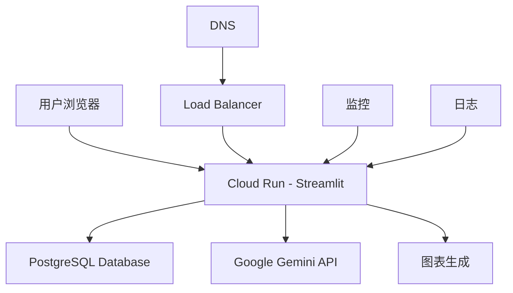

# PandasAI Dashboard 部署指南

## 📋 概述

这是一个基于PandasAI的智能数据分析平台，部署在Google Cloud Run上，支持自然语言查询、实时数据可视化和多Partner数据分析。

## 🚀 快速部署

### 1. 环境准备

```bash
# 确保已安装必要工具
gcloud --version
docker --version

# 登录Google Cloud
gcloud auth login
gcloud config set project solar-idea-463423-h8
```

### 2. 一键部署

```bash
# 运行部署脚本
./deploy_pandasai_dashboard.sh
```

## 🌐 域名配置

### 自定义域名设置

1. **在DNS服务商配置**
   ```
   记录类型: CNAME
   主机记录: analytics
   记录值: ghs.googlehosted.com
   TTL: 600
   ```

2. **验证域名**
   ```bash
   # 检查域名解析
   nslookup analytics.bytec.com
   
   # 测试HTTPS访问
   curl -I https://analytics.bytec.com
   ```

3. **SSL证书**
   - Google Cloud Run会自动为自定义域名提供SSL证书
   - 证书申请和续期完全自动化

## 📊 功能特性

### 🤖 AI智能查询
- **自然语言支持**: 支持中文问答
- **示例查询**:
  - "今天哪个offer表现最好？"
  - "最近7天的转化趋势如何？"
  - "哪个Sub ID收入最高？"

### 📈 数据可视化
- **实时图表**: Plotly交互式图表
- **多维度分析**: 按Partner、时间、地区分析
- **关键指标**: 转化数、收入、平均单价

### 🎯 Partner管理
- **多Partner支持**: 支持Involve、Digenesia等
- **数据筛选**: 按Partner筛选数据
- **权限控制**: 基于Partner的数据访问

## 🔧 技术配置

### 环境变量

```bash
# 生产环境配置
ENVIRONMENT=production
DB_HOST=34.124.206.16
DB_PORT=5432
DB_NAME=postback_db
DB_USER=postback_admin
DB_PASSWORD=ByteC2024PostBack_CloudSQL_20250708
GOOGLE_CLOUD_PROJECT=solar-idea-463423-h8
GOOGLE_GEMINI_API_KEY=your_gemini_api_key
```

### 资源配置

```yaml
# Cloud Run配置
memory: 4Gi
cpu: 2 vCPU
min_instances: 1
max_instances: 20
timeout: 1800s
concurrency: 10
```

## 📱 访问地址

- **主要地址**: https://analytics.bytec.com
- **默认地址**: https://pandasai-analytics-dashboard-[hash]-as.a.run.app
- **健康检查**: https://analytics.bytec.com/_stcore/health

## 🔐 安全配置

### 生产环境安全
- **HTTPS强制**: 所有请求强制使用HTTPS
- **CORS配置**: 限制跨域访问
- **头部安全**: 启用XSRF保护
- **数据加密**: 数据库连接使用SSL

### API密钥管理
- **Gemini API Key**: 通过环境变量安全传递
- **数据库密码**: 使用Google Secret Manager（推荐）

## 📊 监控和日志

### 查看日志
```bash
# 实时日志
gcloud run services logs tail pandasai-analytics-dashboard --region=asia-southeast1

# 历史日志
gcloud run services logs read pandasai-analytics-dashboard --region=asia-southeast1 --limit=100
```

### 性能监控
```bash
# 服务状态
gcloud run services describe pandasai-analytics-dashboard --region=asia-southeast1

# 指标监控
gcloud monitoring metrics list --filter="resource.type='cloud_run_revision'"
```

### 健康检查
```bash
# Streamlit健康检查
curl -f https://analytics.bytec.com/_stcore/health

# 应用健康检查
curl -f https://analytics.bytec.com/
```

## 🛠️ 维护操作

### 更新部署
```bash
# 重新部署
./deploy_pandasai_dashboard.sh

# 更新单个配置
gcloud run services update pandasai-analytics-dashboard \
  --region=asia-southeast1 \
  --set-env-vars="GOOGLE_GEMINI_API_KEY=new_key"
```

### 扩缩容配置
```bash
# 调整实例数
gcloud run services update pandasai-analytics-dashboard \
  --region=asia-southeast1 \
  --min-instances=2 \
  --max-instances=30

# 调整资源
gcloud run services update pandasai-analytics-dashboard \
  --region=asia-southeast1 \
  --memory=8Gi \
  --cpu=4
```

### 故障排除
```bash
# 检查服务状态
gcloud run services describe pandasai-analytics-dashboard --region=asia-southeast1

# 查看错误日志
gcloud run services logs read pandasai-analytics-dashboard \
  --region=asia-southeast1 \
  --filter="severity>=ERROR"

# 重启服务
gcloud run services update pandasai-analytics-dashboard \
  --region=asia-southeast1 \
  --set-env-vars="RESTART_TIMESTAMP=$(date +%s)"
```

## 💰 成本优化

### 成本估算
- **基础费用**: $30-50/月 (中等使用量)
- **计算资源**: $0.000024/vCPU秒 + $0.0000025/GB秒
- **网络流量**: $0.12/GB (出站)
- **存储**: 基本免费

### 优化建议
1. **最小实例数**: 设置为1避免冷启动
2. **自动扩缩容**: 根据流量自动调整
3. **缓存配置**: 启用数据缓存减少数据库查询
4. **CDN**: 对静态资源使用CDN

## 🔄 数据流架构



## 📝 API文档

### 健康检查端点
```http
GET /_stcore/health
```

### 数据查询
- **自然语言查询**: 通过Web界面
- **数据筛选**: Partner、时间范围
- **图表生成**: 自动生成可视化

## 🎯 最佳实践

### 性能优化
1. **缓存策略**: 启用5分钟数据缓存
2. **连接池**: 使用数据库连接池
3. **异步处理**: 大量数据查询使用异步处理

### 安全实践
1. **环境变量**: 敏感信息使用环境变量
2. **HTTPS**: 强制使用HTTPS
3. **访问控制**: 基于IP或认证的访问控制

### 监控实践
1. **错误追踪**: 启用错误日志监控
2. **性能监控**: 监控响应时间和资源使用
3. **告警设置**: 设置故障告警

## 📞 技术支持

### 常见问题
1. **部署失败**: 检查Docker和gcloud配置
2. **域名不可访问**: 检查DNS配置
3. **AI查询失败**: 验证Gemini API Key
4. **数据库连接失败**: 检查网络和权限

### 联系方式
- **技术支持**: 查看日志和监控指标
- **文档更新**: 定期更新本指南
- **问题反馈**: 通过日志系统跟踪问题

---

## 🎉 部署完成后的验证

1. **访问测试**
   ```bash
   curl -f https://analytics.bytec.com
   ```

2. **功能测试**
   - 打开Web界面
   - 测试自然语言查询
   - 验证数据可视化

3. **性能测试**
   - 查看响应时间
   - 检查资源使用情况
   - 验证自动扩缩容

**🎊 恭喜！PandasAI Dashboard 已成功部署并可通过 https://analytics.bytec.com 访问！** 